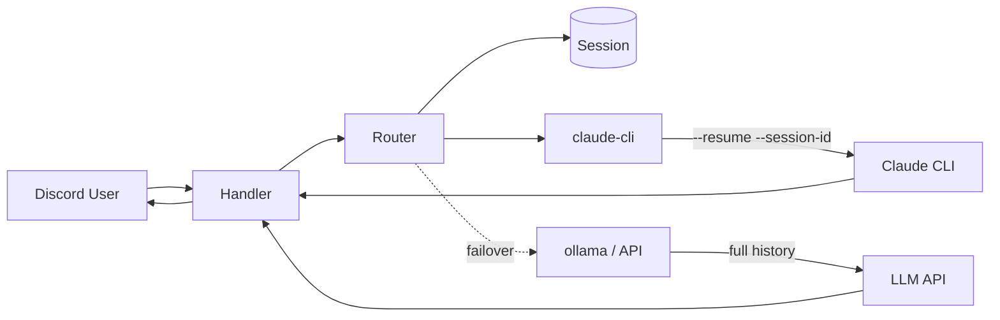

<p align="center">
  
</p>

<h1 align="center">pigeon-claw</h1>

<p align="center">
  <strong>A lightweight Discord-based remote Mac agent.</strong><br>
  Control your Mac through Discord chat — powered by LLMs with automatic failover.
</p>

<p align="center">
  <a href="#the-token-problem">Why?</a> •
  <a href="#quick-start">Quick Start</a> •
  <a href="#providers">Providers</a> •
  <a href="#discord-commands">Commands</a> •
  <a href="#configuration">Config</a> •
  <a href="#korean">한국어</a>
</p>

---

## The Token Problem

Tools like [openclaw](https://github.com/openclaw/openclaw) are incredible — but they **eat tokens for breakfast**. A single complex task can burn through 50K–100K+ tokens because the agent replays the entire conversation history, loads multiple memory files, and injects a massive system prompt on every turn.

If you're on Claude Max ($200/mo), you hit rate limits fast. If you're on API billing, your wallet suffers.

**pigeon-claw fixes this:**

```
openclaw (typical request):
  System prompt: ~8,000 tokens (AGENTS.md + SOUL.md + TOOLS.md + MEMORY.md + skills)
  Conversation:  Full history replay every turn
  Memory search: Vector DB queries injected into context
  Total per turn: 30,000–100,000+ tokens

pigeon-claw (same request):
  System prompt: ~300 tokens (concise, no bloat)
  Conversation:  Claude CLI session resume (only new message sent per turn)
  Memory:        None in prompt (sessions persisted to disk, not context)
  Total per turn: 1,000–5,000 tokens
```

**That's 10–20x fewer tokens per interaction.** Same agent capabilities, fraction of the cost.

## How?

| | pigeon-claw | openclaw / others |
|---|---|---|
| **System prompt** | ~300 tokens, action-oriented | ~8,000+ tokens, multi-file injection |
| **Context management** | Claude CLI session resume (new message only) | Full history replay every turn |
| **Memory** | File-persisted sessions, zero prompt overhead | Vector DB + JSONL loaded into context |
| **Language** | Go (single binary, zero runtime deps) | Node.js / Python |
| **Providers** | Claude CLI + OpenAI + Gemini + Ollama | Claude only |
| **Failover** | Automatic with context export | None |
| **Sessions** | Survives crashes (JSON on disk) | In-memory (lost on restart) |
| **Setup** | Interactive wizard (`pigeon-claw init`) | Manual config |
| **Diagnostics** | `pigeon-claw doctor` | None |

## Features

- **Multi-provider** — Claude CLI, Claude API, OpenAI, Gemini, Ollama
- **Per-channel sessions** — File-persisted conversation context
- **Mention mode** — Respond to all messages or only when @mentioned
- **Hot reload** — Change config without restarting (`SIGHUP`)
- **Runtime model switching** — Change models from Discord with `!model`
- **Token tracking** — Shows provider + token count on every response
- **Daemon management** — `start/stop/restart/reload/status/logs`
- **Custom prompts** — Override system prompt via file
- **macOS integration** — Shell, AppleScript, screenshots, full disk access

## Prerequisites

- **macOS** (Apple Silicon or Intel)
- **Go 1.21+** — `brew install go` (only needed if building from source)
- **Discord account** — to create a bot

## Installation

### Homebrew (recommended)

```bash
brew tap tackish/pigeon-claw https://github.com/tackish/pigeon-claw
brew install pigeon-claw
```

### Build from source

```bash
git clone https://github.com/tackish/pigeon-claw.git
cd pigeon-claw
make build
```

## Quick Start

### Step 1: Create a Discord Bot

1. Go to [Discord Developer Portal](https://discord.com/developers/applications)
2. Click **New Application** → enter a name → **Create**
3. Go to **Bot** tab (left sidebar):
   - Click **Reset Token** → **Copy** the token (you'll need this later)
   - Scroll down to **Privileged Gateway Intents**:
     - Enable **Message Content Intent** (required — without this, the bot receives empty messages)
   - Scroll up to **Authorization Flow**:
     - Make sure **Requires OAuth2 Code Grant** is **OFF**
4. Go to **OAuth2** tab (left sidebar):
   - Under **OAuth2 URL Generator**, check only **`bot`** in Scopes
   - Under **Bot Permissions**, check: `Send Messages`, `Attach Files`, `Read Message History`, `View Channels`, `Embed Links`, `Add Reactions`
   - Copy the generated URL at the bottom
   - Open it in your browser → select your server → **Authorize**

> **Note:** No redirect URI is needed. The bot scope doesn't require OAuth2 callback.

### Step 2: Set up Claude CLI (recommended provider)

```bash
# Install Claude Code CLI
npm install -g @anthropic-ai/claude-code

# Log in (opens browser for authentication)
claude login
```

> Requires a [Claude Max/Pro subscription](https://claude.ai/settings/billing). No API key needed — the CLI authenticates via your browser session.

> **⚠️ Important: Anthropic Third-Party Tool Policy**
>
> As of April 2026, Anthropic [prohibits using Claude subscription OAuth tokens in third-party tools](https://www.theregister.com/2026/02/20/anthropic_clarifies_ban_third_party_claude_access/). pigeon-claw uses `claude -p` (the official Claude Code CLI) directly — it does **not** extract or intercept OAuth tokens. However, using subscription credentials to power autonomous agent loops through any wrapper may still conflict with [Anthropic's Consumer Terms of Service](https://www.anthropic.com/policies/consumer-terms).
>
> **Use at your own risk.** If you want to be fully compliant, use the `claude` provider with an `ANTHROPIC_API_KEY` instead of `claude-cli`. API usage is billed separately and has no third-party restrictions.

**Alternative: Ollama (free, local)**

```bash
brew install ollama
brew services start ollama
ollama pull gemma4:e4b       # lightweight model
```

### Step 3: Run setup wizard

```bash
pigeon-claw init
```

The interactive wizard will walk you through:
1. Discord bot token
2. LLM provider selection (Claude CLI, Ollama, API keys)
3. Channel configuration
4. macOS permissions (Full Disk Access, Accessibility, Screen Recording, Automation)

Config is saved to `~/.pigeon-claw/config`.

### Step 4: Run

```bash
pigeon-claw start          # background daemon
pigeon-claw serve          # foreground (useful for debugging)
```

That's it! Go to your Discord server and start chatting with the bot.

> **Tip:** Running `pigeon-claw` with no arguments will auto-launch the wizard if no config exists.

### Finding Channel IDs

To restrict the bot to specific channels, you need Discord channel IDs:

1. Open Discord → **User Settings** (gear icon) → **Advanced** → Enable **Developer Mode**
2. Right-click any channel → **Copy Channel ID**
3. Add to `~/.pigeon-claw/config`:
   ```bash
   ALLOWED_CHANNELS=123456789012345678
   MENTION_CHANNELS=987654321098765432
   ```

## Providers

| Provider | Description | Requirements |
|---|---|---|
| `claude-cli` | Runs Claude CLI (recommended) | [Claude Max/Pro](https://claude.ai) + `claude login` |
| `claude` | Anthropic API | `ANTHROPIC_API_KEY` |
| `openai` | OpenAI API | `OPENAI_API_KEY` |
| `gemini` | Google Gemini API | `GEMINI_API_KEY` |
| `ollama` | Local Ollama | `ollama serve` running |

```bash
# Recommended: Claude CLI first, Ollama as fallback
PROVIDER_PRIORITY=claude-cli,ollama
```

When a provider fails (error, rate limit, timeout), pigeon-claw automatically tries the next one. Conversation context is exported and injected into the fallback provider.

## Configuration

Config is loaded from `~/.pigeon-claw/config`. Created automatically by `pigeon-claw init`.

Run `pigeon-claw -h` for the full list.

| Variable | Required | Default | Description |
|---|---|---|---|
| `DISCORD_TOKEN` | **Yes** | - | Discord bot token |
| `PROVIDER_PRIORITY` | No | `claude,openai,gemini,ollama` | Comma-separated priority |
| `ALLOWED_CHANNELS` | No | (all) | Channels that respond to all messages |
| `MENTION_CHANNELS` | No | - | Channels that respond only to @mentions |
| `SYSTEM_PROMPT_FILE` | No | `~/.pigeon-claw/prompt.md` | Custom prompt file path |
| `REQUEST_TIMEOUT` | No | `30s` | Provider timeout |
| `EXEC_TIMEOUT` | No | `60s` | Shell command timeout |
| `MAX_TOOL_ITERATIONS` | No | `10` | Max tool use loop iterations |
| `MAX_TOOL_OUTPUT` | No | `4000` | Max tool result length (chars) |
| `SESSION_DIR` | No | `~/.pigeon-claw/sessions/` | Session file directory |
| `LOG_LEVEL` | No | `info` | `debug`, `info`, `warn`, `error` |

## Discord Commands

Type these in any channel the bot is active in:

| Command | Description | Example |
|---|---|---|
| `!reset` | Clear current channel session | `!reset` |
| `!status` | Show active provider and message count | `!status` |
| `!provider` | Show provider priority with models | `!provider` |
| `!model` | List all provider models | `!model` |
| `!model <provider> <model>` | Change model at runtime | `!model ollama gemma4:e4b` |

### Examples

```
# Switch to a lighter Ollama model
!model ollama gemma4:e4b

# Switch Claude to Opus
!model claude-cli claude-opus-4-20250514

# Check what's running
!status
```

## Custom Prompts

Override the system prompt with a file. Priority order:

1. `SYSTEM_PROMPT_FILE` env var path
2. `~/.pigeon-claw/prompt.md` (default location)
3. `SYSTEM_PROMPT` env var (inline)
4. Built-in default prompt

```bash
cat > ~/.pigeon-claw/prompt.md << 'EOF'
You are a helpful assistant with full macOS access.
Always be concise.
EOF
```

## Daemon Management

```bash
pigeon-claw start      # Start as background daemon
pigeon-claw stop       # Stop the daemon
pigeon-claw restart    # Restart (stop + start)
pigeon-claw reload     # Hot reload config (SIGHUP)
pigeon-claw status     # Check if running
pigeon-claw logs       # Tail logs in real-time
pigeon-claw doctor     # Diagnose config, permissions, and connectivity
```

To keep the Mac awake and connected:
```bash
sudo pmset -a sleep 0
sudo pmset -a networkoversleep 0
```

### Doctor

Run `pigeon-claw doctor` to check everything at once:

```
$ pigeon-claw doctor

[Config]
  ✓ Config found: ~/.pigeon-claw/config
  ✓ DISCORD_TOKEN is set
  ✓ PROVIDER_PRIORITY is set

[Claude CLI]
  ✓ Binary: ~/.local/bin/claude
  ✓ Version: 2.1.91

[Ollama]
  ✓ Ollama is running (localhost:11434)

[macOS Permissions]
  ✓ Screen Recording
  ✓ Accessibility

[Daemon]
  ✓ Running (PID 46062)

---
✓ 10 passed
```

## Tools (for API providers)

`claude-cli` uses its own built-in tools (shell, file access, web search, etc.).

API providers (claude, openai, gemini, ollama) use pigeon-claw's built-in tools:

| Tool | Description |
|---|---|
| `shell_exec` | Execute any shell command |
| `read_file` | Read file contents |
| `write_file` | Write/create files |
| `screenshot` | Capture macOS screen |
| `list_dir` | List directory contents |
| `osascript` | Run AppleScript for macOS automation |

## Status Reactions

The bot reacts to your messages with emoji to show what's happening:

| Emoji | Meaning |
|---|---|
| 👀 | Processing your request |
| ✅ | Completed (simple response) |
| ⚙ | Completed (used tools) |
| 🔧 | Completed (heavy tool use, 6+ calls) |
| 📸 | Screenshot included |
| ⚡ | Fallback provider was used |
| ❌ | All providers failed |

When `claude-cli` is running a complex task, you'll also see intermediate status updates (e.g., `🔧 shell_exec`, `thinking...`) that auto-delete when the response arrives.

## Architecture



**Claude CLI** uses `--session-id` + `--resume` — only the new message is sent each turn, not the full history. Other providers fall back to sliding window (last N messages).

---

## Korean

pigeon-claw는 Discord 기반 원격 Mac 에이전트입니다. openclaw의 무거운 토큰 사용을 해결하기 위한 경량 프록시로, Discord 채널에서 대화하면 LLM이 Mac을 자율 제어합니다.

자세한 내용은 위 영문 문서를 참고하세요. 기본 응답 언어는 한국어로 설정되어 있습니다.

## License

MIT
